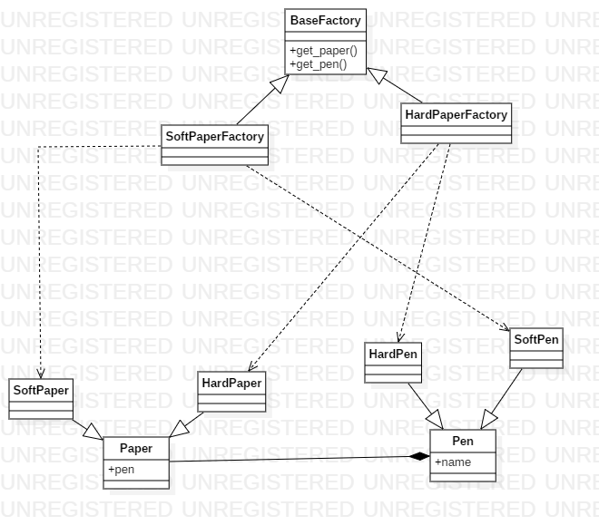

# Absract Factory

## Explicación del ejemplo

El ejemplo consiste en la creación de `Paper` (lienzos) y `Pen` (lapices). Hay diferentes tipos de `Paper` (soft y hard) y un `Pen` adecuado para cada uno de estos. Mediante los `Abstract Factory`, que son `HardPaperFactory` y `SoftPaperFactory` se garantiza la creación del lienzo y el lapiz adecuado para cada caso.

## Diagrama de clases

