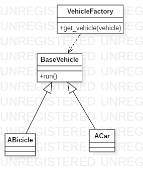

# Factory Method

## Explicación del ejercicio

A través de `VehicleFactory` se pueden crear dos tipos de vehículos, `ACar` y `ABicicle`, ambos de tipo `BaseVehicle`. La clase `VehicleFactory` recibe el tipo de vehículo que se quiere crear y devuelve una instancia del tipo de objeto especificado

## Diagrama de clases

