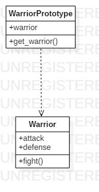

# Prototype

## Explicación del ejercicio

Mediante el `WarriorPrototype` se clonan diferentes guerreros (`Warrior`) con las mismas características (ataque y defensa), para, finalmente, hacer que "luchen" (con el método `fight` en  `Warrior`)

## Diagrama de clases

