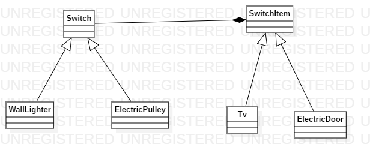

# Facade

## Explicación del ejercicio

se requiere separar la funcionalidad del dispositivo con su respectiva accion de On para esto se realiza un puente entre una interfaz de el item y la abstracion del switch

## Diagrama de clases

