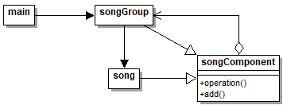

# Composite

## Explicación del ejercicio

Mediante el `SongComponent` se definen dos clases para este ejercicio: `Song` y `SongGroup`. `SongGroup` está compuesta de una lista de instancias de `Song` o de `SongGroup`, y en cuanto se llama a la operación de una instancia de `SongGroup`, esta recorre tanto las instancias de `Song` como de `SongGroup`.

## Diagrama de clases

