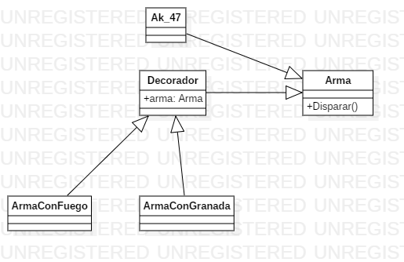

# Facade

## Explicación del ejercicio

un arma es decorada por varias envolturas con distintos atributos, esto se puede visualizar con los prints que genera cada uno de las envolturas
## Diagrama de clases

