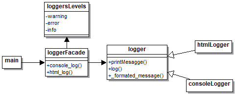

# Facade

## Explicación del ejercicio

Mediante el `LoggerFacade` se da acceso al cliente para usar los loggers disponibles, que son `HtmlLogger` y `ConsoleLogger`. El primero, como su nombre lo dice, se encarga de loggera información de cierto tipo en un archivo html, mientras el segundo se encarga de loggear la información en una consola.

## Diagrama de clases

