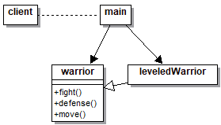

# Proxy

## Explicación del ejercicio

Mediante el `LeveledWarrior`, el cual recibe el nivel del guerrero a crear, se crea una instancia de `Warrior` que, a partir del nivel, se agregan características y se aumentan las capacidades de este

## Diagrama de clases

